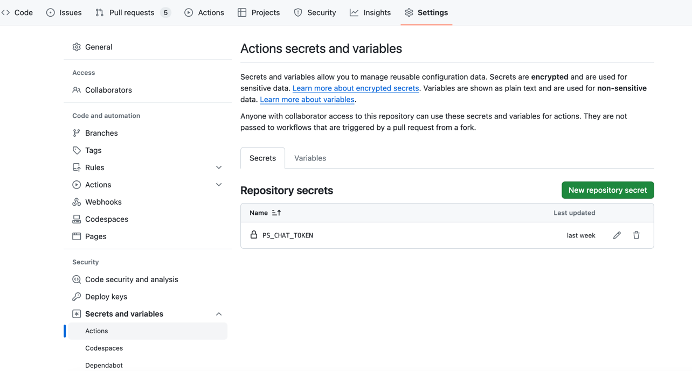

# PS Code Review Assistant

Welcome to the PS Code Review Assistant, a GitHub Action powered by the Publicis Sapient AI for enhancing code reviews in your repositories. This action automates and augments the code review process, providing valuable insights and suggestions to improve your code quality.

# Setup

## 1. Add a workflow like this in your repo.

To start using the PS Code Review Assistant in your GitHub repositories, follow these simple steps:

1. **Create or Edit a Workflow File**: In your repository, create a new workflow file (e.g., `.github/workflows/code-review.yml`) or edit an existing one.

2. **Configure the Workflow**: Add the following steps to your workflow configuration:

   ```yaml
   name: PS Code Review Assistant

   on:
     pull_request:
       types:
         - opened
         - synchronize

   jobs:
     review:
       runs-on: ubuntu-latest
       steps:
         - name: Checkout Repo
           uses: actions/checkout@v3
         - name: PS Code Review Assistant
           uses: PublicisSapient/ps-code-review-assistant@main # This action is currently hosted in a personal repository.
                                                               # It will be migrated to the official PS organization repository in the future.
         with:
           GITHUB_TOKEN: ${{ secrets.GITHUB_TOKEN }} # The GITHUB_TOKEN is there by default so you just need to keep it like it is and not necessarily need to add it as secret as it will throw an error. [More Details](https://docs.github.com/en/actions/security-guides/automatic-token-authentication#about-the-github_token-secret)
           PS_CHAT_TOKEN: ${{ secrets.PS_CHAT_TOKEN }}
           prompt: "" # Optional: Could add the stack of the project for a better prompt
           exclude: "**/*.json, **/*.md" # Optional: exclude patterns separated by commas


## 2. Secret configuration

Configure an PS_CHAT_TOKEN secret inside your repository settings (Security > Secrets and variables > Actions) . https://github.com/{org}/{repo}/settings/secrets/actions
- Add your OpenAI API key from the API key section (https://platform.openai.com/account/api-keys)

)